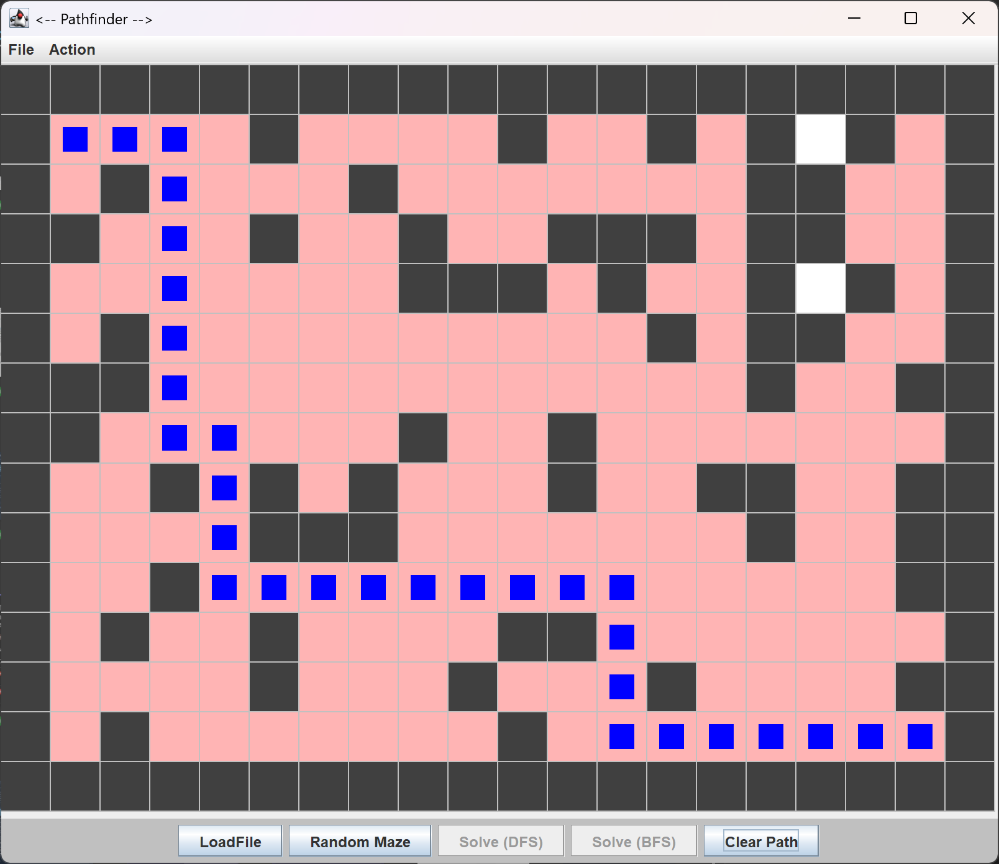

# Pathfinder - Maze Solver

A Java-based maze generation and solving application. This project uses custom data structures and classic search algorithms to find paths from a start tile to an exit tile, all visualized through a Swing GUI.

## Features
*   **Custom Data Structures:** Implements generic Linked Lists, Stacks, and Queues from scratch to support the search algorithms.
*   **Search Algorithms:** 
    *   **Depth-First Search (DFS):** Uses a custom `MyStack` to explore paths deeply before backtracking.
    *   **Breadth-First Search (BFS):** Uses a custom `MyQueue` to explore paths layer by layer, ensuring the shortest path is found.
*   **Random Maze Generator:** Creates random maze layouts with configurable dimensions and a 30% obstacle density.
*   **Interactive GUI:** A Java Swing interface to load files, generate new mazes, and run/visualize the solvers in real-time.
*   **File I/O:** Reads and writes maze layouts to and from `.txt` files.

## Project Structure
*   `MazeSolver.java`: The core engine for parsing maze files and running DFS/BFS.
*   `MazeGenerator.java`: Utility for generating randomized `.txt` maze files.
*   `MazeSolverGUI.java`: The main entry point containing the Swing interface.
*   `MazeTile.java` (and subclasses): Defines the properties and passability of walls and paths.
*   `Node.java`, `MyStack.java`, `MyQueue.java`, `MyLinkedList.java`: Custom data structures for traversal and path reconstruction.

## Visual Demo
*(Add a screenshot of the solved maze here)*

## How to Run
1.  Compile all `.java` files: `javac *.java`
2.  Run the GUI: `java MazeSolverGUI`
3.  Use the `File` menu or the buttons to load a `.txt` maze or generate a random one.
4.  Click `Solve (DFS)` or `Solve (BFS)` to visualize the path.

## Technologies Used
*   Java
*   Java Swing (GUI)
*   Object-Oriented Programming (OOP)
